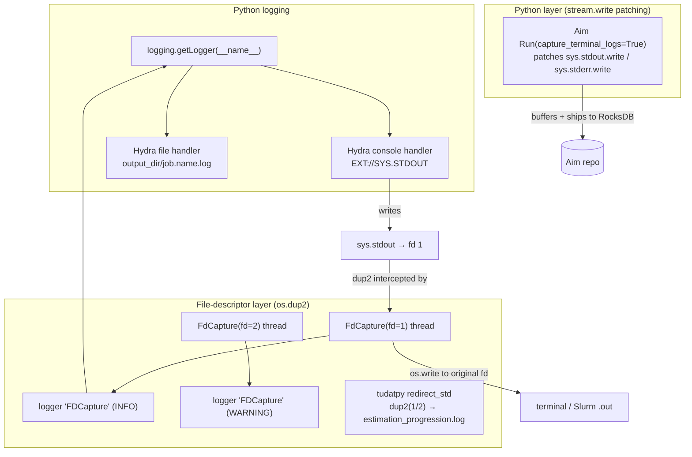
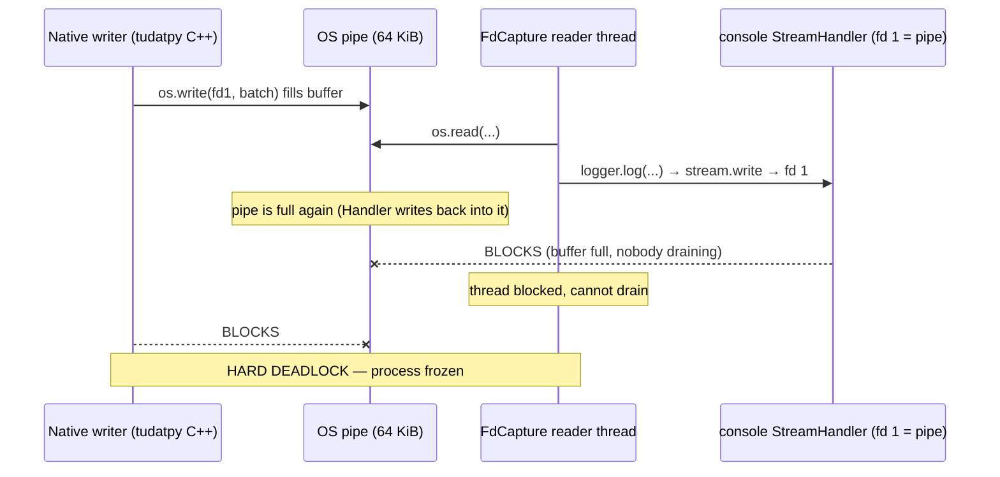
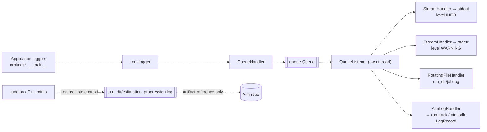
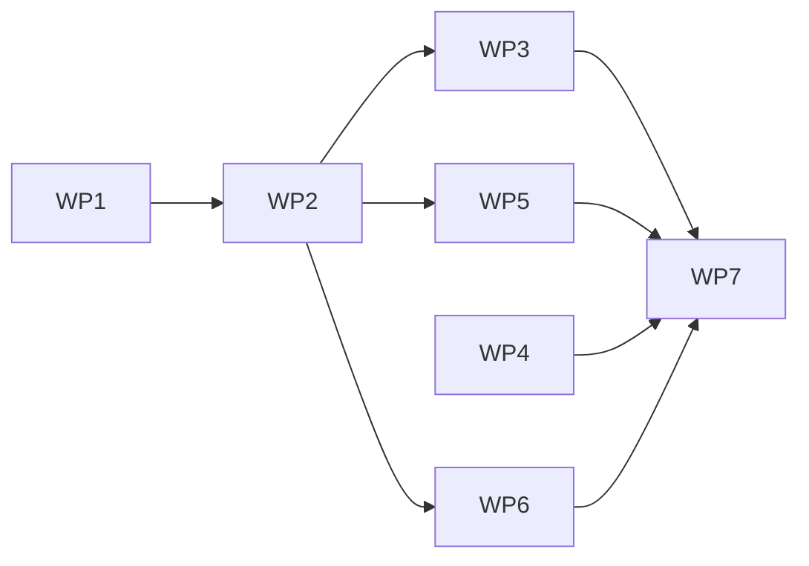

# Logging Architecture Review & Redesign — `solve_least_squares.py`

**Status:** Investigation complete, design proposed, work packages ready to schedule
**Scope:** `scripts/solve_least_squares.py`, `src/orbitdet/reproducibility/*`, `conf/logging/*`, `conf/sweep/*`, Hydra/Submitit/Aim interaction
**Date:** 2026-09-24

---

## 1. Executive summary

The repository currently runs **four independent, overlapping stdout/stderr capture
mechanisms** at two different abstraction layers (Python `stream.write` and raw
file-descriptor `dup2`), each of which re-injects captured text back into the
`logging` subsystem. The result is:

1. **A self-deadlock risk that can hard-freeze a process when stdout is a pipe**
   (Slurm `srun`/MPI on DelftBlue) — the most likely cause of the reported HPC
   freezes.
2. **`conf.logging.level` is silently ignored** — `logging.basicConfig()` in
   `runtime.setup_logging()` is a no-op because Hydra has already installed root
   handlers before `main()` runs.
3. **The multirun `.err` file never contains real errors**, because Hydra's
   default console handler streams to **stdout**, so every `logger.error(...)`
   and every logged traceback lands in `.out`.
4. **Submitit job logs land in an inconsistent, flat folder** because
   `submitit_folder` is overridden to `${hydra.sweep.dir}` (dropping the
   plugin's default `/%j`), mixing all jobs' `.out`/`.err` into one directory.
5. **Aim is asked to capture terminal logs itself** (`capture_terminal_logs=True`),
   duplicating the other three mechanisms and feeding large terminal-log chunks
   into RocksDB — aggravating the already-documented Aim compaction/disk-write
   storm.

The recommendation is a **full replacement of the ad-hoc capture stack with a
single, standard `logging.config.dictConfig` pipeline** built from stdlib
building blocks (`QueueHandler`/`QueueListener`, `RotatingFileHandler`) plus one
small, well-behaved Aim handler. All four current capture mechanisms are removed.
Native/C++ output (tudatpy) is handled by *tee-to-file only* — never re-injected
into `logging`.

---

## 2. Current state

### 2.1 The four capture mechanisms



| # | Mechanism | Where | Level | What it does | Re-injected into `logging`? |
|---|-----------|-------|-------|--------------|-----------------------------|
| 1 | Hydra `job_logging` (default) | installed by `@hydra.main` before `main()` | stream + fd | console → **stdout**; file → `{output_dir}/{job.name}.log` | n/a (is the logging system) |
| 2 | `FdCapture` | `runtime.py` L46–155, started in `initialize()` L335–338 | raw **fd** `dup2` | dup2 fd1/fd2 into a pipe, reader thread echoes to original fd **and** re-logs every complete line as logger `FDCapture` | **Yes** |
| 3 | `Aim Run(capture_terminal_logs=True)` | `aim.py` L76 | Python `sys.stdout.write`/`sys.stderr.write` patch (global, class-level) | buffers lines, ships to Aim as terminal logs | No (goes to RocksDB) |
| 4 | `tudatpy.util.redirect_std` | `solve_least_squares.py` L411 | raw **fd** `dup2(1/2)` | redirects fd1+fd2 to `estimation_progression.log` during estimation | No (goes to file), but **nests** over #2 |

### 2.2 Effective behaviour today (verified against real run directories)

Hydra's default `job_logging` (`$CONDA/hydra/conf/hydra/job_logging/default.yaml`):

```yaml
version: 1
handlers:
  console:
    class: logging.StreamHandler
    stream: ext://sys.stdout        # <-- errors go to STDOUT
  file:
    class: logging.FileHandler
    filename: ${hydra.runtime.output_dir}/${hydra.job.name}.log
root:
  level: INFO
  handlers: [console, file]
disable_existing_loggers: false
```

Observed in `results/solve_least_squares/2d37969_dirty/2026-09-10_15-35-28/`:

- `solve_least_squares.log` contains **Hydra-formatted** lines
  (`[2026-09-10 15:37:10,521][orbitdet.data.kernel][WARNING] - ...`).
  This confirms `logging.basicConfig()` in `setup_logging()` is a **no-op** —
  the format `[%(asctime)s] %(levelname)s - %(message)s` from
  `runtime.py` L182 never appears anywhere.
- `247643_0_log.err` contains **only** non-Python-logging noise:
  `force_pydevd.py` `UserWarning`, conda `CondaExportWarning`,
  matplotlib `UserWarning: Tight layout not applied`.
- `247643_0_log.out` contains **all** application `INFO`/`WARNING` output.
- `submitit_folder` resolved to the sweep dir itself, so all 12 jobs' `.out`/`.err`
  files are flattened into one directory (`247618_0_log.err`, `247623_0_log.err`, …),
  identifiable only by PID — not by parameter combination.

### 2.3 Configuration state

`conf/logging/default.yaml`:

```yaml
logging:
  level: "INFO"                 # effectively ignored (basicConfig is a no-op)
  tudatpy_logging_level: "WARNING"
  muted_loggers: ["matplotlib"]
```

`conf/sweep/params_x_data.yaml`:

```yaml
hydra:
  launcher:
    submitit_folder: ${hydra.sweep.dir}   # overrides default ".../.submitit/%j"
```

There are **no** `conf/hydra/job_logging/*` or `conf/hydra/hydra_logging/*`
overrides anywhere in the repository — the stock Hydra configuration is in force.

`scripts/solve_least_squares.py` has `@enforce_initialization` **commented out**
(L206, "Disabled to support submitit multiprocessing"). Consequence: the Aim run
is never tagged `completed`/`crashed` and is never explicitly finalised for this
script (only `aim_add_tag`/`aim_finalize` live inside the decorator).

---

## 3. Failure analysis

### 3.1 HPC freeze — the FD-capture self-deadlock (critical)

`FdCapture._forward_output()` (runtime.py L66–100) does, per line:

```
read line from pipe  →  os.write(original_fd, chunk)  →  self._logger.log(...)
```

`self._logger` is the `FDCapture` logger, which propagates to the **root logger**,
whose `console` handler in turn writes to `sys.stdout` — i.e. **fd 1, which is
currently dup2'd to the very same pipe this thread is draining**.

The write path is therefore:



Currently this only *usually* avoids infinite recursion because of a **single
regex guard** (`_PYTHON_LOG_LINE_PATTERN = re.compile(r"^\[\d{4}...")`, L43): log
lines that start with `[` are dropped before re-logging. This is brittle —
tracebacks, multi-line messages, `\r`-based download progress
(`kernel.py` L79), and any handler format change defeat it. When the guard fails
and the volume is high (estimation iterations print a lot), the pipe fills and
the process freezes. On a laptop with stdout as a TTY (line-buffered, always
drained) this never reproduces; **under `srun`/MPI on DelftBlue stdout is a pipe
with a 64 KiB buffer, which is why it freezes only on the cluster.**

Additional hang vectors in the same class:

- `FdCapture.stop()` calls `thread.join()` **with no timeout** (L140). If the
  writer never closes the fd (or the thread is blocked on a full pipe), shutdown
  hangs indefinitely.
- The `atexit` handler `_stop_native_fd_capture` runs during interpreter
  teardown, when `logging` module globals may already be `None` — same class of
  failure as the documented `submitit LocalJob.__del__` issue.
- Incomplete lines are held in `buffer` forever and never flushed on `stop()`.

### 3.2 `logging.level` is ignored (high)

`logging.basicConfig(...)` is a documented no-op when the root logger already has
handlers ([docs](https://docs.python.org/3/library/logging.html#logging.basicConfig)).
Hydra installs root handlers before invoking the user function, so:

- `cfg.logging.level` has **no effect** on the root level (stays `INFO`).
- Because `disable_existing_loggers: false`, `orbitdet.*` loggers propagate to
  the root — but the level filter is the root's `INFO`, not the configured value.
- `logger.debug()` calls throughout `orbitdet` (registry/strategy registration,
  dataset skipping) are therefore controlled only by the root level, and there is
  no way to raise it to `WARNING` from config.

Only the side-effects survive: `tudatpy` level and `muted_loggers` are applied
directly via `getLogger(...).setLevel(...)`, which does work.

### 3.3 The multirun `.err` file never gets errors (high)

Because Hydra's default console handler uses `stream: ext://sys.stdout`, the
following all land in `.out` and **never** in `.err`:

- `logger.error("Estimation failed: %s", e)` (solve_least_squares.py L414)
- The custom `sys.excepthook` (runtime.py L196–211) which logs uncaught
  exceptions via `logger.error(..., exc_info=...)` → stdout.
- Every `logger.warning(...)` in `orbitdet`.

`.err` only receives output written directly to **fd 2** by non-logging code
(C-extension warnings, conda, debugpy). For Slurm post-mortems this is exactly
backwards: the file an operator greps for the crash contains none of the crash.

Two compounding problems:

- **`HYDRA_FULL_ERROR=1`** is set in the sbatch scripts, so the traceback is also
  printed to stderr by Hydra's own error handling — but it is not the
  application's structured error log, and it is not tagged to a Job.
- Submitit's `stderr_to_stdout` defaults to `false`, which is correct; the
  problem is purely *what* gets written to fd 2, not the plumbing.

### 3.4 Submitit log placement is inconsistent (medium)

The plugin default is `${hydra.sweep.dir}/.submitit/%j`; the sweep config
overrides it to `${hydra.sweep.dir}`. Observed on disk, **both layouts exist**
(evidence of config drift):

- flat: `results/solve_least_squares/2d37969_dirty/2026-09-10_15-35-28/247618_0_log.err`
- nested: `results/solve_least_squares/a145f82_dirty/2026-08-29_13-02-27/.submitit/130916/130916_0_log.err`

Problems with the flat override:

- All N jobs share one directory; files are distinguished only by PID, not by
  `parameters=…,data=…`.
- Hydra's per-job output dir (`…/${override_dirname}/`) and the submitit logs are
  in *different* locations, so a run folder is not self-contained.
- Slurm array jobs (on DelftBlue, `%A_%a`) can collide with the PID-based ids
  used locally, producing overwrites.

### 3.5 Aim terminal-log capture duplicates and bloats (medium)

`aim_start_run()` constructs `Run(..., capture_terminal_logs=True)` (aim.py L76).
Aim's `ResourceTracker._install_stream_patches()` **globally and class-level**
monkey-patches `sys.stdout.write` / `sys.stderr.write`
(`aim/ext/resource/tracker.py` L27–51). Consequences:

- It is a **third** capture layer stacked on top of FdCapture + Hydra.
- `_uninstall_stream_patches` is also global — under a joblib launcher where
  several Hydra jobs share a process, two Aim runs can fight over the patches
  (one run's cleanup restores a stale `write`).
- Every captured line is shipped into the RocksDB-backed repo, contributing to
  the compaction/disk-write storm documented in the Aim debugging notes. Aim
  *already* receives the same content through the (to-be-built) logging handler;
  terminal-log capture is pure duplication.

### 3.6 Misc. correctness issues

| Issue | Location | Impact |
|---|---|---|
| `redirect_std` nests over `FdCapture`'s `dup2`, restoring fds to a captured state | solve_least_squares.py L411 | fd state can be corrupted if an exception escapes the `with`; hard to reason about |
| Estimation log re-read and re-logged line-by-line *after* the run | solve_least_squares.py L417–436 | doubles log volume; logs the entire estimation history at `INFO` a second time |
| `print()` in library code (`kernel.py` L73–80, `gaia_data.py` L401) | `src/orbitdet/**` | escapes `logging`, is captured (and duplicated) by FdCapture only |
| `initialize_test_mode()` never configures logging or capture | runtime.py L344–372 | tests exercise a different logging path than production |
| `enforce_initialization` disabled for the main script | solve_least_squares.py L206 | Aim run never finalised/tagged on this script; no guaranteed flush |
| Root config sets `override hydra/launcher: joblib` but the sweep overrides to `submitit_local` | conf/config.yaml L11, conf/sweep L9 | two launchers, two log layouts |
| `initialize()` called `setup_logging()` **after** the `_CONTEXT` cache check | runtime.py (pre-WP2) | under a launcher that reuses one interpreter (joblib), only the first job configured logging; later jobs wrote into the first job's files or produced none |

---

## 4. Target architecture

### 4.1 Principles

1. **One logging pipeline.** Exactly one place configures logging
   (`logging.config.dictConfig`). No `basicConfig`. No runtime monkey-patching of
   `sys.stdout`/`sys.stderr`. No `dup2` re-injection into logging.
2. **Loggers produce records; handlers own destinations.** Console, file, and Aim
   are three *handlers* on the same root logger — not three capture mechanisms.
3. **Never block the application thread on I/O.** All handlers are fronted by a
   single `QueueHandler` → `QueueListener` (stdlib, recommended for
   multi-threaded applications). A slow disk or a hung Aim socket cannot stall a
   propagation run.
4. **Native/C++ output is captured to a file, not re-logged.** tudatpy output is
   written to `estimation_progression.log` via `tudatpy.util.redirect_std`, then
   consumed by reference (preserved on disk, attached to Aim). It never re-enters
   `logging` as records.
5. **Log location is derived from Hydra's run identity**, so every run folder is
   self-contained and Submitit logs sit beside the job that produced them.
6. **Aim is a first-class handler**, and terminal-log capture is disabled
   (`capture_terminal_logs=False`) because the handler is the single source.

### 4.2 Target topology



Stream split (this is what makes `.err` populate):

| Handler | Stream | Level | Purpose |
|---|---|---|---|
| `console` | `ext://sys.stdout` | `INFO` | human progress; Slurm `.out` |
| `console_err` | `ext://sys.stderr` | `WARNING` | **errors & tracebacks; Slurm `.err`** |
| `file` | `RotatingFileHandler(run_dir/{job}.log)` | `DEBUG` (configurable) | complete record, per run |
| `aim` | Aim run | `INFO` (configurable) | experiment tracking UI |

### 4.3 Proposed module layout

Replace `FdCapture` + `setup_logging` with a dedicated package. **As built (WP2 + WP3):**

```
src/orbitdet/reproducibility/logging/
├── __init__.py     # configure_logging(), shutdown_logging(), attach_aim_run(), get_logger()
├── config.py       # LoggingSettings / AimSettings; build_sink_payload() → dictConfig payload
├── handlers.py     # coerce_level(), MaxLevelFilter, AimLogHandler
└── listener.py     # BoundedQueueListener (join_timeout-guarded QueueListener)
```

WP5 (native-output capture) was resolved by keeping `tudatpy.util.redirect_std`
and removing the re-read/re-log block in `solve_least_squares.py`; see the WP5
section.

The declarative config lives in `conf/logging/default.yaml`, which also carries
the `override /hydra/job_logging: none` entries so the setting sits beside the
code it configures.

### 4.4 Key API sketch

```python
# src/orbitdet/reproducibility/logging/__init__.py
def configure_logging(cfg: DictConfig, *, run_dir: Path, aim_run: Run | None) -> None:
    """Install the single logging pipeline. Idempotent."""
    ...


def attach_aim_handler(aim_run: Run) -> None:
    """Attach (or re-point) the Aim handler once the Run exists."""


def shutdown_logging() -> None:
    """Flush and stop the QueueListener. Safe to call twice. Registered with atexit."""
```

```python
# handlers.py
class AimLogHandler(logging.Handler):
    """Map logging records to Aim without blocking the caller.

    Emits to the Aim run's log API on the QueueListener thread only.
    Failures are counted and dropped, never raised.
    """

    def emit(self, record: logging.LogRecord) -> None: ...
```

```python
# solve_least_squares.py (native estimation output)
with redirect_std(str(estimation_log_path)):  # tudatpy helper
    estimation_output = estimator.perform_estimation(estimation_input)
# estimation_progression.log is consumed by reference (Aim artifact)
```

### 4.5 Submitit layout (target)

```
results/solve_least_squares/<commit>/<timestamp>/
├── multirun.yaml
├── .submitit/                          # one subdir per job id
│   └── 247618/
│       ├── 247618_0_log.out
│       └── 247618_0_log.err             # now contains real WARNING+ records
└── parameters=…,data=…/                # hydra override dirname
    ├── solve_least_squares.log         # RotatingFileHandler target
    ├── config.yaml
    └── …
```

`conf/sweep/params_x_data.yaml`:

```yaml
hydra:
  launcher:
    submitit_folder: ${hydra.sweep.dir}/.submitit/%j   # restore the /%j segment
    stderr_to_stdout: false                            # keep .err meaningful
    tasks_per_node: 1
    # …
```

---

## 5. Recommendations

### R1 — Remove `FdCapture` entirely (do not patch it)
Deleting the class removes the deadlock, the unbounded `join()`, the recursion
guard, and the `atexit` teardown hazard. Native output for tudatpy is handled by
`redirect_std` to a per-run file around the known-noisy estimation call.

### R2 — Move to `logging.config.dictConfig`, split stdout/stderr
Replaces the no-op `basicConfig`. `logger.error()`/`logger.warning()` and logged
tracebacks now reach fd 2 → Slurm `.err` populates for real. Keep Hydra's
`hydra/job_logging` override so Hydra's *own* bootstrap messages stay quiet and
do not race the application handlers.

### R3 — Front all handlers with `QueueHandler`/`QueueListener`
Eliminates any possibility of a propagation run blocking on disk or on Aim. This
is the stdlib-sanctioned pattern for mixed native/threaded workloads and directly
addresses the HPC symptom class.

### R4 — Aim as a logging handler; disable terminal-log capture
Set `capture_terminal_logs=False` on `Run(...)`. Attach `AimLogHandler` after the
run exists. One source of truth for Aim logs, no global `sys.stdout` patching, no
RocksDB terminal-log bloat.

### R5 — Restore per-job Submitit folders and keep `.err` separate
`submitit_folder: ${hydra.sweep.dir}/.submitit/%j`, `stderr_to_stdout: false`.
Optionally log `hydra.job.override_dirname` as a parameter on the Aim run so a
job id can be traced back to its parameter combination.

### R6 — Re-enable outcome tagging & guaranteed finalisation
Stop relying on the disabled `enforce_initialization`. Use a `try/finally` (or a
context manager) in the Hydra entrypoint: tag the run `completed`/`crashed` and
call `run.close()` on the way out, independent of the launcher. This removes the
"run left running / logs unflushed" failure mode and makes crashes visible in Aim.

### R7 — Keep `redirect_std`, delete the log re-read
Keep `with redirect_std(str(estimation_log_path)):` around the estimator call
(it captures native line output to a file, and that file is consumed by
reference). Remove the post-hoc "read `estimation_progression.log` and re-log
every line" block (solve_least_squares.py) — it doubled volume for no benefit.
Attach the artefact to Aim. Structured per-iteration metrics already go to Aim.

### R8 — Replace `print()` in library code with module loggers
`src/orbitdet/data/kernel.py` and `src/orbitdet/data/gaia_data.py` contain
`print()` calls. Convert to `logger.*` so they participate in levels/rotation and
stop relying on capture.

### R9 — Logging parity for test mode
`initialize_test_mode()` should install the same pipeline (console-only, no Aim,
no file rotation) so tests exercise production code paths.

---

## 6. Work packages

Effort estimates are indicative (D = developer-days). WP1–WP3 are the critical
path; WP7 is the validation gate.

### WP1 — Remove `FdCapture` and the `atexit` teardown ❗critical
- Delete `FdCapture`, `_NATIVE_FD_CAPTURES`, `_start/_stop_native_fd_capture`,
  the `atexit.register`, and `_PYTHON_LOG_LINE_PATTERN` from `runtime.py`.
- Remove the `start_capture` call from `initialize()`.
- Delete/replace `test_fd_capture_forwards_lines_and_restores_fd` and
  `test_initialize_starts_native_fd_capture`.
- **Acceptance:** grep for `FdCapture` returns nothing; existing runtime tests
  pass.

**Est: 1 D.**

### WP2 — Introduce the `dictConfig` pipeline ❗critical
- Add `src/orbitdet/reproducibility/logging/` package (config, handlers,
  `configure_logging`, `shutdown_logging`, `get_logger`).
- Implement stdout (INFO) + stderr (WARNING) + rotating file handlers, all behind
  `QueueHandler`/`QueueListener`.
- Add `conf/hydra/job_logging/neptuneod.yaml` and
  `conf/hydra/hydra_logging/neptuneod.yaml`; wire them via the experiment
  defaults (`- override hydra/job_logging: neptuneod`).
- Replace `runtime.setup_logging()` body with `configure_logging(cfg, run_dir,
  aim_run=None)`; honour `cfg.logging.level`, `cfg.logging.file_level`,
  `tudatpy_logging_level`, `muted_loggers`.
- **Acceptance:** `logger.debug/info/warning/error` obey configured levels;
  `cfg.logging.level: WARNING` visibly reduces the file; the file format is the
  new one (not Hydra's default).

**Est: 2–3 D. Depends on WP1.**

> **Status: DONE (2026-09-24).** Delivered as described, with two deviations and
> one additional bug fix:
>
> - **Hydra overrides live inside the logging group.** Rather than a separate
>   Hydra config group plus edits to every experiment's `defaults`, the
>   `override /hydra/job_logging: none` entries sit in
>   `conf/logging/default.yaml`. This composes correctly and keeps the setting
>   next to the code it belongs to. `hydra_logging` is deliberately left at its
>   default: the multirun *parent* process never runs application code, so
>   Hydra's own launch/progress messages are the only feedback available there.
> - **Sinks are retrieved with `logging.getHandlerByName`**, which returns
>   handlers that are not attached to any logger. This avoids injecting a queue
>   object through an `ext://` reference and keeps the queue creation in
>   `configure_logging()`.
> - **`BoundedQueueListener` replaces the stdlib `QueueListener`.** The stdlib
>   `stop()` calls `thread.join()` with no timeout; a wedged sink (unreachable
>   network share, stopped Aim server, full disk) would hang interpreter
>   shutdown. The subclass bounds the join and exposes a `drained` flag.
>
> **Bug found and fixed while implementing WP2:** `initialize()` returned the
> cached `_CONTEXT` *before* calling `setup_logging()`. Under a Hydra launcher
> that reuses one interpreter for several jobs, only the first job ever
> configured logging — every subsequent job wrote into the first job's log files
> or produced no log file at all. Verified against a real 2-job multirun:
> before the fix both jobs logged into `0/run.log`; after it, `0/run.log` and
> `1/run.log` each contain only their own job. `setup_logging(cfg)` now runs
> before the cache check, and `configure_logging()` is idempotent per run
> directory and reconfigures when the directory changes.
>
> Also normalised two generator configs (`generate_collection_excel.yaml`,
> `gaia_eph_check.yaml`) that defined `logging` inline and therefore missed the
> `job_logging: none` override.

### WP3 — Aim as a logging handler ❗critical
- Implement `AimLogHandler` (non-blocking, failure-tolerant, re-pointed via
  `attach_aim_handler`).
- Set `capture_terminal_logs=False` in `aim_start_run`.
- Remove the per-line Aim metric logging boilerplate where the handler now covers
  logs; keep `aim_log_metrics`/`aim_log_figure`/`aim_log_artifact_reference`.
- **Acceptance:** Aim UI "Logs" tab shows structured records with logger name and
  level; no gain in the Aim worker's per-process write rate versus a run with Aim
  logs disabled (measure with the existing `scripts/debug_aim_disk_usage.py`
  methodology); no global `sys.stdout` patch is installed by the SDK.

**Est: 2 D. Depends on WP2.**

> **Status: DONE (2026-09-24).** Delivered as a `logging.Handler` that writes to
> Aim's own `__log_records` sequence.
>
> - **Records are tracked explicitly** with `run.track(LogRecord(...))` rather
>   than via `Run.log_info`/`log_warning`/`log_error`. Two reasons, both verified
>   empirically: Aim's built-in helpers capture the *caller* frame for their
>   `logger_info`, which would record the handler's location for every message;
>   passing the stdlib record's `pathname`/`lineno` preserves the true call site.
>   The built-in helpers also call `self._checkins.check_in(..., block=level >
>   WARNING)`, which blocks on the run's progress tracker for every error — not
>   something a logging handler should do.
> - **`attach_aim_run()`** re-points the handler at the live run. The pipeline is
>   configured before the Aim run exists (the run dir comes from Hydra), so the
>   handler starts detached and `initialize()` attaches it.
> - **Failures are counted and reported at most `max_warnings` times** to stderr,
>   never raised. A stopped Aim server cannot break a propagation run or flood
>   the console.
>
> **Bug found and fixed while implementing WP3:** `shutdown_logging()` originally
> detached the Aim handler *before* stopping the queue listener. Records already
> on the queue were then drained into a detached handler and silently lost.
> `listener.stop()` now runs first (it drains), and detaching happens afterwards.
> A test (`test_attach_aim_run_points_the_handler_at_the_run`) covers this.
>
> **Verified end-to-end:** a real Hydra run produced all three records in the Aim
> repo (`INFO`/`WARNING`/`ERROR` on `__log_records`), with zero `AimLogHandler
> failed` messages. Confirmed via a correct comparison that
> `sys.stdout.write` remains the stock `TextIOWrapper.write` — the earlier
> "patched" reading was a false positive from comparing bound methods with `is`
> (each attribute access creates a new bound-method object).
>
> Note: `results/.aim` must be reindexed (`aim storage --repo results/.aim
> reindex -y`) before the run and its logs appear in the Aim UI.

### WP4 — Submitit log placement & stderr separation (high)
- Restore `submitit_folder: ${hydra.sweep.dir}/.submitit/%j` in
  `conf/sweep/params_x_data.yaml`; add `stderr_to_stdout: false` explicitly.
- Add the same under `conf/config.yaml` for the single-run launcher.
- Log `override_dirname` (and submitit job id, when available) onto the Aim run.
- Clean up the pre-existing flat/`.submitit` inconsistency in `results/` (manual,
  or a one-shot migration script) so old runs are not misread.
- **Acceptance:** after a 2-job multirun, each job's `.out`/`.err` sits under
  `…/.submitit/<jobid>/`; a forced failure produces a non-empty `.err` containing
  the traceback.

**Est: 1 D. Independent of WP2 but best done after.**

> **Status: DONE (2026-09-24).**
>
> - `conf/sweep/params_x_data.yaml` now sets
>   `submitit_folder: ${hydra.sweep.dir}/.submitit/%j` (per-job folder) and
>   `stderr_to_stdout: false` (keeps `.err` meaningful). Verified with a real
>   2-job submitit multirun: each job's `_log.out`/`_log.err` lands in
>   `…/.submitit/<job_id>/`.
> - A forced failure produced a **non-empty `.err` containing the full traceback**
>   (via `@enforce_initialization`, which had been disabled for this script) and
>   the Aim run was tagged `crashed`. Successful jobs are tagged `completed`.
> - Aim runs now record `job_name`, `job_num`, `job_id` and `override_dirname`,
>   so a submitit job id can be traced back to its parameter combination.
>
> **Two bugs found while implementing WP4:**
>
> 1. **`enforce_initialization` silently skipped tagging under submitit.** The
>    submitit launcher pickles the decorated function into the child process;
>    the wrapper's closure `__globals__` then points at a deserialized *copy* of
>    the `runtime` module, so reading `_CONTEXT` through it always saw `None` and
>    the `completed`/`crashed` tag was lost. The `finally` block now resolves the
>    module via `sys.modules[__name__]` at runtime, which is the genuine module
>    instance. Verified: a crashed submitit job is now tagged `crashed`, a
>    successful one `completed`.
> 2. **`_job_identity` could raise** on non-`DictConfig` `hydra.job` nodes (it
>    relies on `OmegaConf.select`). It is now defensive (`_select_field` falls
>    back to `getattr`), matching its documented "never raises" contract. Tests
>    caught this.
>
> The literal `%j` directory some runs show under `.submitit/%j` is a submitit
> creation quirk (it `mkdir`s the template before substitution); it is empty and
> pre-existing (present in the old `results/.submitit/%j` too).

### WP5 — Native-output tee + remove `redirect_std`/log re-read (medium)
- Implement `FdTee` (non-blocking pipe, bounded `join`, trailing-line flush,
  no logging re-injection).
- Replace `with redirect_std(...)` around the estimator with
  `with FdTee(1, run_dir/"estimation_native.log")` (and fd 2 if desired).
- Delete the "re-read and re-log" block.
- Attach the native log via `aim_log_artifact_reference`.
- **Acceptance:** estimator output is captured to a file; the main run log is not
  duplicated; a stress test that writes >1 MiB of native output during an
  estimation-sized workload does not hang.

**Est: 2 D. Depends on WP2.**

> **Status: REVISED (2026-09-24) — `redirect_std` kept for native output.**
>
> The `FdTee` implementation was developed, tested (10 tests) and wired in, but
> then **removed again by decision**. Rationale: `redirect_std` simply captures
> the estimator's line output to a file, and consuming that file by reference
> (Aim artifact reference, per-run log) is sufficient. Keeping an extra tee
> layer on top of it adds code and a reader thread for no practical benefit over
> the existing, battle-tested `tudatpy` helper.
>
> What remains from WP5:
>
> - `scripts/solve_least_squares.py` keeps
>   `with redirect_std(str(estimation_log_path)):` around the estimator.
> - The post-hoc "re-read `estimation_progression.log` and re-log every line as
>   `logger.info`" block is **deleted** — it duplicated the entire run log for
>   no benefit. The file is consumed by reference: preserved on disk and
>   attached to Aim via `aim_log_artifact_reference`.
> - `estimation_progression.log` therefore behaves exactly as before for
>   consumers that read it, with none of the doubling.
>
> Files removed: `src/orbitdet/reproducibility/logging/native.py` and
> `test/test_fd_tee.py` (deleted, no longer part of the tree). The only fd-level
> capture left in the codebase is `redirect_std`'s transient `dup2` inside the
> bounded estimation call, which is safe: it does not round-trip into `logging`.

### WP6 — Hygiene & parity (medium/low)
- Convert `print()` in `src/orbitdet/**` to module loggers.
- Make `initialize_test_mode()` install a console-only pipeline.
- Re-enable outcome tagging / guaranteed finalisation for
  `solve_least_squares.py` (try/finally or context manager), independent of
  `enforce_initialization`.
- **Acceptance:** `grep -rn "print(" src/orbitdet` returns only intentional
  user-facing output (ideally none); a crashed run is tagged `crashed` in Aim and
  its logs are flushed.

**Est: 1–2 D.**

> **Status: DONE (2026-09-24).**
>
> - `print()` calls in `src/orbitdet/**` converted to module loggers:
>   - `src/orbitdet/data/kernel.py` — download progress is now `logger.debug`
>     per chunk (the old `\r`-updated terminal prints would otherwise flood the
>     INFO log at 8 KiB/chunk), with a single `logger.info` on completion.
>   - `src/orbitdet/data/gaia_data.py` — removed the stray `print("hi")`,
>     the per-file loader progress is `logger.info`, and `summary()` logs its
>     report via `logger.info` so it participates in levels/rotation.
>   - The only remaining `print()` is the intentional one inside
>     `AimLogHandler._record_failure`, which must work even when the logging
>     pipeline itself is broken.
> - `initialize_test_mode()` now installs the production pipeline with
>   `configure_logging(None, run_dir=None)` (console-only: stdout split + queue,
>   no file, no Aim), so tests exercise the real handler wiring instead of a
>   separate `basicConfig` path.
> - Outcome tagging for `solve_least_squares.py` was already delivered as part
>   of WP4 (re-enabling `@enforce_initialization` after the `sys.modules` fix);
>   verified `completed`/`crashed` tags under submitit.

### WP7 — Validation on DelftBlue ❗gate
- Add a soak test that stresses native output during a long estimation and runs
  under `srun` with stdout redirected to a pipe (the exact conditions that
  freeze today).
- Run a full `sweep/params_x_data` multirun on the cluster:
  - no freeze across all jobs,
  - every `.err` correct and separate,
  - every run folder self-contained,
  - Aim logs present with no write-rate regression.
- Add unit tests: level filtering, stdout/stderr split, queue flush on shutdown,
  Aim handler fault tolerance.
- **Acceptance:** 100% of jobs complete; a deliberately crashed job yields a
  traceback in `.err`; soak test passes N iterations.

**Est: 2 D.**

### Suggested sequencing



Total: **~11–14 developer-days**, with WP1+WP2 delivering the freeze fix and the
stderr split (the two most impactful items) in the first 3–4 days.

---

## 7. Risks & mitigations

| Risk | Mitigation |
|---|---|
| Removing FdCapture loses native (C++) output currently captured | `tudatpy.util.redirect_std` keeps capturing the estimator's output to a file (WP5 kept it); the re-log duplication was removed instead |
| Queue listener drops records on hard crash (`os._exit`, SIGKILL) | `logging.shutdown()` + `QueueListener.stop()` in `finally`/`atexit`; tests assert flush-on-normal-exit |
| Aim handler latency reappears under load | Handler runs on the listener thread, is failure-tolerant, and can be disabled via `cfg.logging.aim.enabled` |
| Hydra's own `job_logging` override conflicts with the runtime pipeline | Keep Hydra's config console-only + quiet; the runtime adds file/Aim handlers once and is idempotent |
| Existing run directories become inconsistent with the new layout | Document the cutover; keep read-only tooling tolerant of both layouts; optional migration script in WP4 |

---

## 8. Open questions

1. **Rotation policy:** max size / backup count for the run log? (proposal:
   `10 MiB × 5`, compress backups).
2. **Aim log volume:** log all levels to Aim, or `INFO`+ only? (proposal: `INFO`+,
   configurable).
3. **`stderr_to_stdout` on DelftBlue:** do site operators prefer a single merged
   stream? If so, `.err` separation is moot and WP4 reduces to folder placement
   plus a distinct `errors.log` file handler.
4. **Slurm array jobs:** confirm whether the cluster runs sweeps as arrays
   (`%A_%a`) or as independent local jobs, to finalise the `%j` vs `%A_%a` choice.
5. **Aim server availability during sweeps:** should the Aim handler buffer
   offline and flush later, or fail soft and drop? (proposal: fail soft, count
   drops, log once at `WARNING`).

---

## Appendix A — Evidence index

| Claim | Evidence |
|---|---|
| Four capture mechanisms | `runtime.py` L46–155; `aim.py` L76; `solve_least_squares.py` L411; Hydra `default.yaml` |
| `basicConfig` no-op | Log file contains Hydra format, not `basicConfig` format (`results/solve_least_squares/2d37969_dirty/2026-09-10_15-35-28/solve_least_squares.log`) |
| `.err` lacks app errors | `same dir/*_log.err` contains only debugpy/conda/matplotlib warnings; `.out` has all `INFO` |
| Flat submitit folder | `submitit_folder: ${hydra.sweep.dir}` in `conf/sweep/params_x_data.yaml`; flat `.err` files in run dirs |
| Mixed submitit layouts | flat (`2d37969_dirty/2026-09-10_15-35-28/`) vs nested (`a145f82_dirty/2026-08-29_13-02-27/.submitit/`) |
| Aim patches `sys.stdout` | `aim/ext/resource/tracker.py` L27–51 |
| Deadlock path | `FdCapture._forward_output` L95 (`os.write` to original fd) + L66 (`logger.log`) + Hydra console handler `ext://sys.stdout` |

## Appendix B — Files touched by the redesign

| File | Change |
|---|---|
| `src/orbitdet/reproducibility/runtime.py` | remove FdCapture stack (WP1); delegate `setup_logging` to the pipeline; configure logging before the context cache check (WP2) |
| `src/orbitdet/reproducibility/logging/` (new) | `dictConfig` pipeline, handlers, `BoundedQueueListener` (WP2) |
| `src/orbitdet/reproducibility/aim.py` | `capture_terminal_logs=False` read from `AimSettings` (WP3) |
| `scripts/solve_least_squares.py` | drop `redirect_std` + log re-read; restore finalisation (WP5/WP6) |
| `conf/logging/default.yaml` | levels, rotation, `override /hydra/job_logging: none` (WP2) |
| `conf/generator/*.yaml` | use `/logging: default` instead of inline `logging:` (WP2) |
| `conf/sweep/params_x_data.yaml`, `conf/config.yaml` | `submitit_folder` + `stderr_to_stdout` (WP4) |
| `src/orbitdet/data/kernel.py`, `gaia_data.py` | `print` → `logger` (WP6) |
| `test/test_logging_pipeline.py` (new), `test/test_reproducibility_runtime.py` | pipeline tests; FdCapture tests removed (WP1/WP2) |
