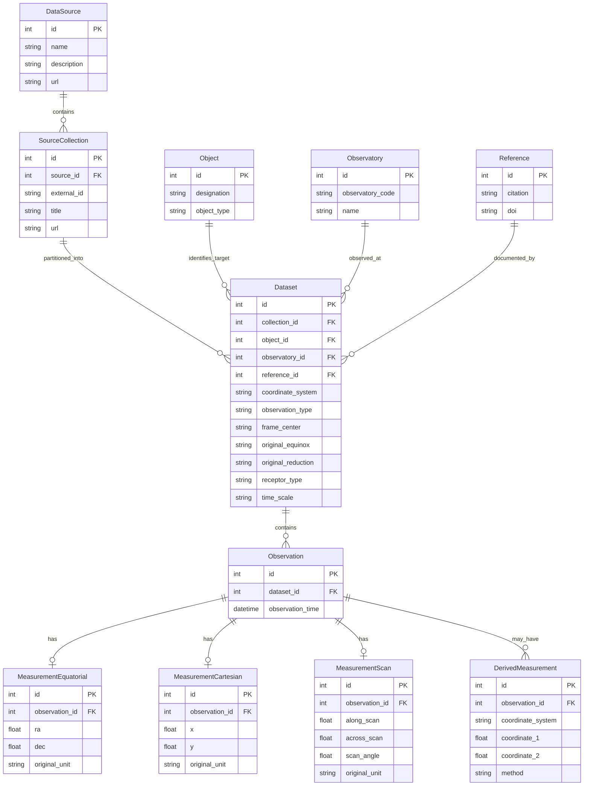

```mermaid
erDiagram
    DataSource ||--o{ SourceCollection : contains
    SourceCollection ||--o{ Dataset : partitioned_into
    Object ||--o{ Dataset : identifies_target
    Observatory ||--o{ Dataset : observed_at
    Reference ||--o{ Dataset : documented_by

    Dataset ||--o{ Observation : contains

    Observation ||--o| MeasurementEquatorial : has
    Observation ||--o| MeasurementCartesian : has
    Observation ||--o| MeasurementScan : has
    Observation ||--o{ DerivedMeasurement : may_have

    DataSource {
        int id PK
        string name
        string description
        string url
    }

    SourceCollection {
        int id PK
        int source_id FK
        string external_id
        string title
        string url
    }

    Dataset {
        int id PK
        int collection_id FK
        int object_id FK
        int observatory_id FK
        int reference_id FK
        string coordinate_system
        string observation_type
        string frame_center
        string original_equinox
        string original_reduction
        string receptor_type
        string time_scale

    }

    Observation {
        int id PK
        int dataset_id FK
        datetime observation_time
    }

    MeasurementEquatorial {
        int id PK
        int observation_id FK
        float ra
        float dec
        string original_unit
    }

    MeasurementCartesian {
        int id PK
        int observation_id FK
        float x
        float y
        string original_unit
    }

    MeasurementScan {
        int id PK
        int observation_id FK
        float along_scan
        float across_scan
        float scan_angle
        string original_unit
    }

    DerivedMeasurement {
        int id PK
        int observation_id FK
        string coordinate_system
        float coordinate_1
        float coordinate_2
        string method
    }

    Object {
        int id PK
        string designation
        string object_type
    }

    Observatory {
        int id PK
        string observatory_code
        string name
    }

    Reference {
        int id PK
        string citation
        string doi
    }
```